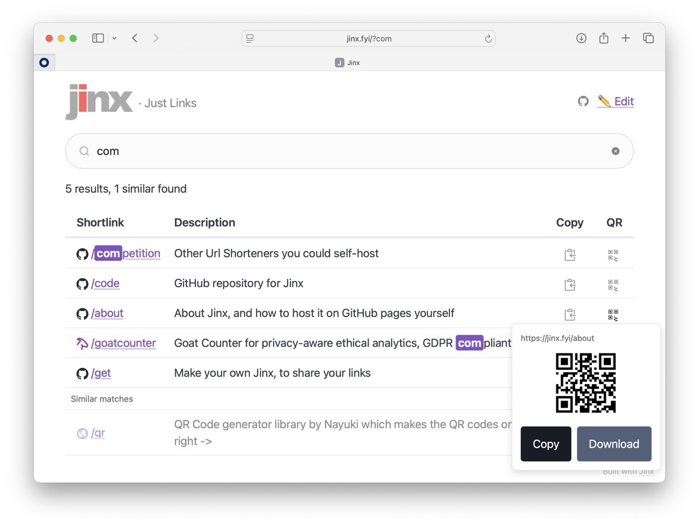

# Jinx

A minimalist, static URL shortener and link directory. Shortlinks redirect instantly via GitHub Pages; the index page lets you browse and search all links. Zero backend, zero database — just a JS file and a custom domain.



## Using shortlinks

Navigate directly to a shortlink to be redirected:

- `jinx.fyi/shortcut` — redirects to the destination URL

## Searching the directory

Visit [jinx.fyi](https://jinx.fyi) to browse all links. Search supports fuzzy matching and separator-insensitive queries (e.g. "gpu doc", "gpu-doc", and "gpudoc" all find `gpu/docs`). Powered by [MiniSearch](https://github.com/lucaong/minisearch) (MIT licence), self-hosted in `minisearch.js`.

Pre-filter by appending a query param: `jinx.fyi?q=bio`

## QR codes

Every link has a QR code button. Generated locally in the browser using the [Nayuki QR Code generator](https://www.nayuki.io/page/qr-code-generator-library) — no external service. From the popup you can copy the QR code as PNG or download it.

## Adding a shortlink

Edit [links.js](links.js) and add an entry to the `REDIRECTS` object:

```js
// Simple redirect
"shortcut": "https://example.com",

// With a description
"shortcut": { url: "https://example.com", description: "What this link is" },
```

Shortlinks can be hierarchical — slashes in the key create nested paths:

```js
"gpu":            { url: "...", description: "GPU cluster overview" },
"gpu/docs":       { url: "...", description: "GPU cluster documentation" },
"gpu/onboarding": { url: "...", description: "GPU onboarding guide" },
```

> **Note:** Every entry must be followed by a comma, including the one before your new entry. Missing commas will break all redirects.

---

## White-labelling

Fork this repo, then make two edits:

### 1. `config.js` — branding & deployment

```js
const CONFIG = {
  title: "My Links",        // shown in header and browser tab
  subtitle: "Quick Links",  // shown beside the title (or null)
  emoji: "🔗",              // decorative emoji (or null)
  editUrl: "https://github.com/your-org/your-repo/edit/main/links.js",
  customDomain: "links.example.com", // or null for GitHub Pages URL only
  repoName: "your-repo",             // your GitHub repo name
  accentColor: "violet",            // Pico CSS colour (see options in config.js)
  goatCounter: null,                // "mysite" for mysite.goatcounter.com, or null
};
```

### 2. `links.js` — your shortcuts

Replace the contents of `REDIRECTS` with your own links (see format above).

### 3. GitHub Pages setup

- Enable GitHub Pages on your repo (Settings → Pages → Deploy from branch `main`)
- If using a custom domain: add it in Settings → Pages → Custom domain, and set up a CNAME DNS record pointing to `your-username.github.io`
- Update the `CNAME` file to your custom domain (or delete it if not using one)

### 4. Analytics (optional)

- **GoatCounter**: create a free account at [goatcounter.com](https://www.goatcounter.com/), set `goatCounter` to your site name
- Leave as `null` to disable analytics
